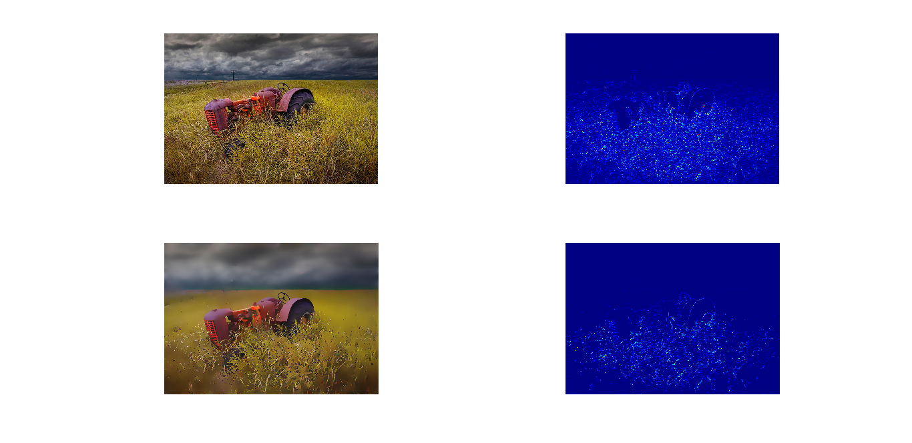

# l0_gradient_minimization
Image Smoothing via L0 Gradient Minimization based on Li Xu, Cewu Lu, Yi Xu and Jiaya Jia's paper.

Similar to TV, I actually reused some of the code, but now it uses another proximal operator. Now with FFT Poisson equation solver.

